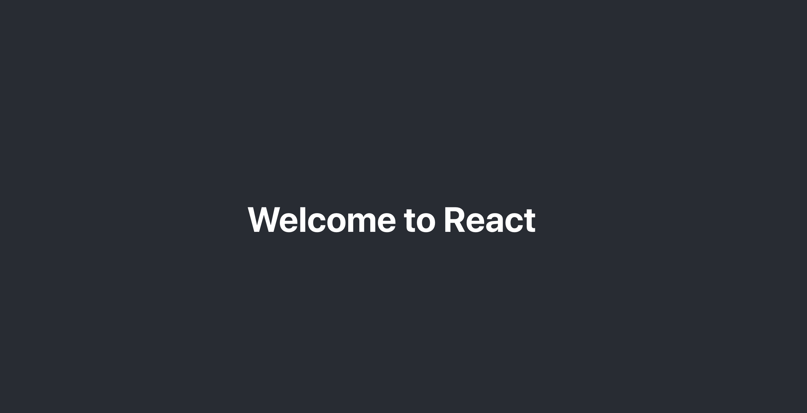

The goal of this section is to install the tools you will need to complete the
tutorial.

# Editor

You will need a code editor of some kind. I will recommend using [VS Code](https://code.visualstudio.com/download) or [Atom](https://atom.io).

> [action]
>
> Download one of the above editors (or another of your choice) to use in the tutorial

# Command Line Tools NPM

Node package Manager is a tool for managing file dependancies.

> [action]
>
> Follow the instructions [here](https://www.npmjs.com/package/npm) and install the version for your computer system.

# Create the boilerplate React App

The first step is to create a boiler plate react app. React provides
a command line tool: `Create React App` that will do this for you.

> [info]
>
> For more background on the `Create React App` tool, you can read about it [here](https://github.com/facebook/create-react-app).

<!-- -->

> [action]
>
> Run the commands below to set up your boiler plate react app:
>
```bash
$ npx create-react-app tmrz-app
$ cd tmrz-app
$ npm start
```

**Note:** The first command above may take a few seconds to install all of file
dependancies. The last command may take a few seconds to start the app for the first time.

When the the above commands are complete, a tab pointed to `localhost` should open in your browser and it should look like the below:



The project is now running on `localhost:3000`. This local server is
for development.

Editing files in the project should trigger the local server to update.
In this way you can see the latest changes immediately in the browser.

# Tour the React App source code

The boilerplate project contains a few files that are arranged in
folders:

- **`src`**: You'll do your work in the `src` folder. *This folder contains
all of the React Components.*
    - **All of the code you create must be stored in the 'src' folder.**
- **`index.js`:** defines `ReactDOM.render()`. This loads and
displays the `App` component. *This is the entry point
for a react app. You won't need to edit this file.*
- **`app.js`:** contains the root component for the app. At the
moment this file defines everything you see when you
run the default app.

You will break your app into components and import these
components into the `App` component. Each new component will
be defined in a new file in the `src` directory.


# Redux

[Redux](https://redux.js.org/) is a tool for managing application state. Redux is based on the [Flux](https://facebook.github.io/flux/) pattern developed by Facebook, which imposes a unidirectional data flow.

*Redux is a JavaScript implementation of Flux,* and while Redux stands on it's own,
it is often used with React.

This happens so often, that there now exists a library that integrates Redux with React called **React-Redux**.

## Import, import, import

Import Redux and React-Redux.

> [action]
>
> Run the following to import redux and react-redux:
>
```bash
$ npm i --save redux
$ npm i --save react-redux
```

## Resources

- https://github.com/facebook/create-react-app

# Now Commit

>[action]
>
```bash
$ git add .
$ git commit -m 'create react app with redux and react-redux'
$ git push
```
