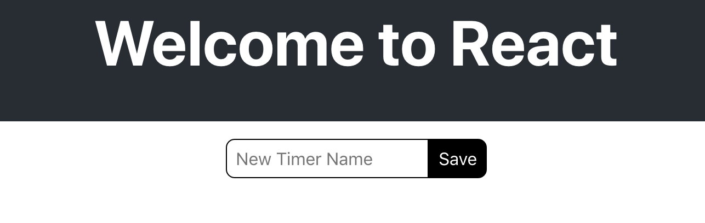

## Technical Planning

1. ~~Build a Timer object~~
1. ~~Define the Actions of a Timer~~
1. ~~Define the Reducers of a Timer~~
1. ~~Allow users to create a Timer~~
1. ~~Allow users to see a list of Timers~~
1. ~~Users should be able to start/stop the clock on their Timers~~
1. **Style the app**
    1. Style the new timer container
    1. Style the new timer input box
    1. Style the new timer input button
    1. Style the timer container
    1. Style the timer text (name, time)
    1. Style the timer start/stop button
1. Allow Timers to persist

In this section we'll walk through the methodology used to apply CSS to the New Timer component and it's elements.

# Class Naming: BEM

Using a good class naming system is important and will make your work easier and your project more organized.

[BEM](http://getbem.com/introduction/) (Block Element Modifier) is a system that describes a best practice for creating class names. This section will apply BEM to the New Timer component.

Let's start with an example in `new-timer.js`. **Note:** the below example has all other features removed, and only shows the JSX elements for clarity.

> [action]
>
> Give the following `className`s to the JSX elements in `/src/components/new-timer.js`:
>
```HTML
<div className='new-timer'>
  <input className='new-timer__input' />
  <button className='new-timer__button' />
</div>
```

Let's break down the BEM syntax used above:

- Notice the child elements share the name of the parent block, in this case: `new-timer`. Using the name of the component also makes sense here as it will help us recognize where these styles are applied.
- Names are lowercase and use a hyphen at the word break.
- Child elements are named with the block name followed by the element name separated by two underscores.

**Why do we do this?**

> [solution]
>
> If you know the system you can easily understand the HTML element structure by reading the CSS.
>
> In this case, hyphens are used to separate words in a name. While the
double underscore identifies the next item as the element.

# Adding Your Own Style

While styles are provided below and in the next chapters, feel free to use your own creative vision in your work. These ideas below might be helpful or inspiring.

Let's get the input and the button to be side by side. This will be easy in the case because both are [inline](https://www.w3schools.com/css/css_inline-block.asp) elements.

# Style the block

Inline elements should be held in a [block](https://www.w3schools.com/html/html_blocks.asp). The parent div provides this.

Let's add some space around the whole block/group by adding a [margin](https://www.w3schools.com/css/css_margin.asp).

> [action]
>
> Create a new file `/src/components/new-timer.css`, and add the following to it:
>
```css
.new-timer {
  margin: 1em;
}
```
> Make sure to import the style in `/src/components/new-timer.js` so that we can see it on the browser:
>
```js
...
import './new-timer.css'
...
```

# Style the Input Element

The input should have larger text and have some space
between the border and the text, so let's add some padding:

> [action]
>
> Add the following to `/src/components/new-timer.css`:
>
```css
.new-timer__input {
  padding: 0.5em;
  font-size: 1em;
}
```

Next let's add a border and make it round on the left and right, and put the two elements side by side.

> [action]
>
> Add the following to `/src/components/new-timer.css`:
>
```css
.new-timer__input {
  padding: 0.5em;
  font-size: 1em;
  border: 1px solid;
  border-radius: 0.5em 0 0 0.5em;
}
```

<!-- -->

> [info]
>
> [border-radius](https://www.w3schools.com/cssref/css3_pr_border-radius.asp) rounds all the corners with a single value. Otherwise you can include a value that sets the radius for all four corners. The first value is the upper left, and the values are applied clockwise.

# Style the Button Element

Next let's style the button to be the same height as the input. We can accomplish this by making the font and padding the same and giving it the
same border width.

> [action]
>
> Add the following to `/src/components/new-timer.css`:
>
```css
.new-timer__button {
  border: 1px solid #000;
  font-size: 1em;
  padding: 0.5em;
}
```

Let's also invert the colors compared to the input.

> [action]
>
> Update `new-timer__button` in `/src/components/new-timer.css` to the following:
>
```css
.new-timer__button {
  border: 1px solid #000;
  font-size: 1em;
  padding: 0.5em;
  background-color: #000;
  color: #fff;
}
```

Finally, round off the two right corners.

> [action]
>
> Update `new-timer__button` in `/src/components/new-timer.css` to the following:
>
```css
.new-timer__button {
  border: 1px solid #000;
  font-size: 1em;
  padding: 0.5em;
  background-color: #000;
  color: #fff;
  border-radius: 0 0.5em 0.5em 0;
}
```

# Product So Far

The end product should look like the following:



Looking good! Great work on **using the BEM system to create class names!** It's a lot easier to style components when there's a clear structure. Let's keep it going by styling our other main component!

## Resources

- http://getbem.com/introduction/
- https://csswizardry.com/2013/01/mindbemding-getting-your-head-round-bem-syntax/

# Now Commit

>[action]
>
```bash
$ git add .
$ git commit -m 'styled new timer input'
$ git push
```
