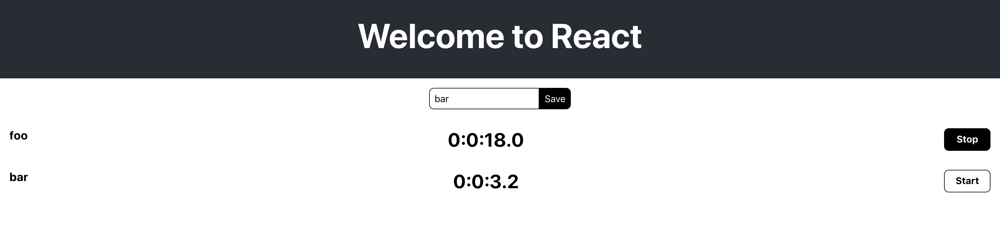

## Technical Planning

1. ~~Build a Timer object~~
1. ~~Define the Actions of a Timer~~
1. ~~Define the Reducers of a Timer~~
1. ~~Allow users to create a Timer~~
1. ~~Allow users to see a list of Timers~~
1. ~~Users should be able to start/stop the clock on their Timers~~
1. **Style the app**
    1. ~~Style the new timer container~~
    1. ~~Style the new timer input box~~
    1. ~~Style the new timer input button~~
    1. Style the timer container
    1. Style the timer text (name, time)
    1. Style the timer start/stop button
1. Allow Timers to persist

We got our New Timer component all nice and dressed up, let's see if we can give a similar treatment to our Timer View!

# Define Class Names

Again following the BEM system. Let's add some classes to our JSX markup

> [action]
>
> Add the following class names to the JSX markup in `/src/components/timer-view.js`. Note again that all other features removed, and only shows the JSX elements for clarity.
>
```js
<div className='timer-view'>
  <div>
    <h2 className='timer-view-name__h2' />
    <h1 className='timer-view-time__h1' />
  </div>
  <button className='timer-view__button'/>
</div>
```

# Style the Block

Now that we have our class names, let's build out the style. Start with using Flex Box to layout the block.

> [action]
>
> Create the file `/src/components/timer-view.css` and add the following to it:
>
```css
.timer-view {
  display: flex;
  flex-direction: row;
  justify-content: space-between;
  align-items: stretch;
  padding: 1em;
}
```

By declaring this element as `display:flex` it becomes a **flex container** and it's children become **flex items.**

The child elements in this case are:

- `<div>`
- `<button>`

There's a few other new properties here, let's break each of them down:

- `flex-direction:row` arranges the elements on the
horizontal axis.
- `justify-content: space-between` adds any extra space
between the flex items with no space on the outside
(far left and right).
- `align-items: stretch` stretches flex items to fill the
container from the top to the bottom. This property
controls the cross-axis.

# Style the Name and Time

Ok our block is ready, let's give the name and time some style too:

> [action]
>
> Add the following to `/src/components/timer-view.css`:
>
```css
.timer-view-name__h2 {
  margin: 0;
  font-size: 1.25em;
}
>
.timer-view-time__h1 {
  margin: 0;
  font-size: 2em;
}
```

The headings `h1` - `h6` all have margin on the top and bottom.
We removed that, and set the size of the font to something a bit more legible and aesthetically pleasing.

> [info]
>
> The `em` unit sets the font size based on the _base_ font size. Setting fonts in this way is good practice, as you can control the size of both elements by setting the `font-size` on the body element.
>
> For example, if the font size of the body element were `12px`, the `h2` would appear as `15px` and `h1` would be `24px`.

# Style the button

Let's bring it home and give our start/stop button some style too:

> [action]
>
> Add the following to `/src/components/timer-view.css`:
>
```css
.timer-view__button {
  width: 78px;
  display: block;
  font-size: 1em;
  font-weight: bold;
  border: 1px solid #000;
  border-radius: 0.5em;
}
```

In order to get the button height/width to be equal, there's no CSS property, or generally easy way to do it. However, there are some [hacks](https://www.w3schools.com/howto/howto_css_aspect_ratio.asp) we can use to accomplish this. To keep things simple for the above, I just measured the height of the container and set the width of the button in px to match (or at least get close to it).

## BEM Modifiers

Some classes are used to modify an element. For example you
might have a class that styles a button and another class
that modifies buttons when they are disabled, or used for
dangerous operations such as deleting.

In the BEM system, you'll put the modifier at the end of the
class name and separate it with two hyphens. For example:

```css
.button {}
.button--disabled {}
.button--dangerous {}
```

These two styles will be used to invert the colors of the
button when the timer is running or stopped.

> [action]
>
> Add the following to `/src/components/timer-view.css`:
>
```css
.timer-view__button--start {
  color: #000;
  background-color: #fff;
}
>
.timer-view__button--stop {
  color: #fff;
  background-color: #000;
}
```

These styles are useless on their own. In order to have them be applied, the modifiers need to be applied to the element in code.

In order for the styles to work correctly, the classes need to be swapped when the button changes state.

> [action]
>
> In the render method of `/src/components/timer-view.js` add the following `const` statement:
>
```js
...
render() {
    const { index, toggleTimer, timer } = this.props;
[bold]    const buttonClass = timer.isRunning ? "stop" : "start";[/bold]
    ...
}
```

`buttonClass` will now have the value of either "stop" or "start" depending on the value of `isRunning`!

Now that we're tracking which state the button is in via a const, we can use that to help us dynamically change the button's `className`!

> [action]
>
> In the JSX markup of `/src/components/timer-view.js`, edit the `className` of the `<button>` to the following:
>
```JS
className={`timer-view__button timer-view__button--${buttonClass}`}
```

# Product So Far

Open your browser and start/stop some timers. They should now look like the following:



Well done! Going through this has hopefully shown the power of **using the BEM system to create class names!** We got one last feature to implement for our timers app, let's wrap this up!

## Resources

- https://www.w3schools.com/css/css3_flexbox.asp

# Now Commit

>[action]
>
```bash
$ git add .
$ git commit -m 'styled timer view'
$ git push
```

# Stretch Challenge

> [challenge]
>
> Make the styles your own. These are pretty simple. You
can do more and improve the appearance!
